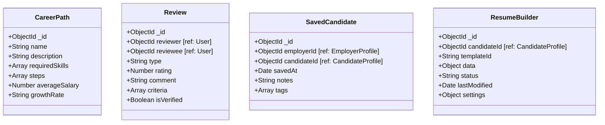

# 📊 DATABASE MODELS CLASS DIAGRAM

## 🔹 **Core User Management**

```mermaid
classDiagram
    class User {
        +ObjectId _id
        +String email [unique]
        +String password [select: false]
        +String authMethod [local/google/hybrid]
        +String googleId
        +String role [candidate/employer/admin]
        +String fullName
        +String avatar
        +ObjectId candidateProfile [ref: CandidateProfile]
        +ObjectId employerProfile [ref: EmployerProfile]
        +Object preferences
        +Object status
        +generateAuthToken()
        +comparePassword()
    }

    class CandidateProfile {
        +ObjectId _id
        +ObjectId userId [ref: User, unique]
        +String status [active/inactive/paused]
        +Object settings
        +Object personalInfo
        +Object targetJob
        +Object education
        +Array certifications
        +Array experience
        +Array skills
        +Array projects
        +Object resume
        +Array appliedJobs
        +Array savedJobs
        +Object visibility
        +Object preferences
    }

    class EmployerProfile {
        +ObjectId _id
        +ObjectId owner [ref: User, unique]
        +Object company
        +Object businessInfo
        +Object position
        +Object legalRepresentative
        +Object contact
        +Array members
        +Object verification
        +Object billing
        +Object analytics
        +String status
    }

    User ||--o| CandidateProfile : "1:1"
    User ||--o| EmployerProfile : "1:1"
```

## 🔹 **Job & Application Management**

```mermaid
classDiagram
    class Job {
        +ObjectId _id
        +ObjectId employer [ref: EmployerProfile]
        +ObjectId postedBy [ref: User]
        +String title
        +String slug [unique]
        +String description
        +String requirements
        +Array skills
        +String industryCode
        +String level
        +String jobType
        +Object salary
        +Date deadline
        +String status
        +Number views
        +Object stats
        +Object ai
        +Array extractedSkills
        +Object matchingPool
    }

    class Application {
        +ObjectId _id
        +ObjectId candidateId [ref: CandidateProfile]
        +ObjectId jobId [ref: Job]
        +String status
        +String coverLetter
        +Array attachments
        +Object resume
        +Object matchingScore
        +Array interviews
        +Array timeline
        +Object feedback
    }

    class SavedJob {
        +ObjectId _id
        +ObjectId candidateId [ref: CandidateProfile]
        +ObjectId jobId [ref: Job]
        +Date savedAt
        +String notes
    }

    EmployerProfile ||--o{ Job : "posts"
    CandidateProfile ||--o{ Application : "applies"
    Job ||--o{ Application : "receives"
    CandidateProfile ||--o{ SavedJob : "saves"
    Job ||--o{ SavedJob : "saved by"
```

## 🔹 **AI & Analysis System**

```mermaid
classDiagram
    class AIAnalysis {
        +ObjectId _id
        +String sourceType [cv/job/skill_assessment]
        +ObjectId sourceId
        +Object content
        +Object nlpResults
        +Object matchingAnalysis
        +Object metadata
        +findLatestAnalysis()
        +findBestMatches()
    }

    class JobRecommendation {
        +ObjectId _id
        +ObjectId candidateId [ref: CandidateProfile]
        +ObjectId jobId [ref: Job]
        +Number score
        +Array reasons
        +String type
        +Object metadata
    }

    class CandidateRecommendation {
        +ObjectId _id
        +ObjectId jobId [ref: Job]
        +ObjectId candidateId [ref: CandidateProfile]
        +Number score
        +Array reasons
        +String type
        +Object metadata
    }

    AIAnalysis ||--o{ CandidateProfile : "analyzes CV"
    AIAnalysis ||--o{ Job : "analyzes job"
    JobRecommendation ||--o| CandidateProfile : "for candidate"
    JobRecommendation ||--o| Job : "recommends job"
    CandidateRecommendation ||--o| Job : "for job"
    CandidateRecommendation ||--o| CandidateProfile : "recommends candidate"
```

## 🔹 **Skills & Learning System**

```mermaid
classDiagram
    class Skill {
        +ObjectId _id
        +String name [unique]
        +String category
        +Array aliases
        +String description
        +Array embedding
        +Number popularity
        +String demandLevel
        +String trend
    }

    class SkillCategory {
        +ObjectId _id
        +String name [unique]
        +String slug [unique]
        +String description
        +String icon
        +String color
        +ObjectId parentCategory [ref: SkillCategory]
        +Boolean isActive
        +Number sortOrder
        +Object metadata
    }

    class SkillRoadmap {
        +ObjectId _id
        +ObjectId candidateId [ref: CandidateProfile]
        +String targetRole
        +Array currentSkills
        +Array targetSkills
        +Array learningPath
        +Object progress
        +String status
    }

    class SkillLearningPath {
        +ObjectId _id
        +String name
        +String description
        +Array prerequisites
        +Array steps
        +Number estimatedHours
        +String difficulty
        +Array resources
    }

    SkillCategory ||--o{ Skill : "contains"
    SkillCategory ||--o{ SkillCategory : "parent-child"
    CandidateProfile ||--o{ SkillRoadmap : "has roadmaps"
    Skill ||--o{ SkillRoadmap : "part of roadmap"
    SkillLearningPath ||--o{ Skill : "teaches"
```

## 🔹 **Communication & Notifications**

```mermaid
classDiagram
    class Notification {
        +ObjectId _id
        +ObjectId recipient [ref: User]
        +ObjectId sender [ref: User]
        +String type
        +String title
        +String message
        +Object data
        +Boolean isRead
        +Boolean isSent
        +String priority
        +Array channels
    }

    class Message {
        +ObjectId _id
        +ObjectId sender [ref: User]
        +ObjectId recipient [ref: User]
        +ObjectId conversationId [ref: Conversation]
        +String content
        +String type
        +Array attachments
        +Boolean isRead
        +Date readAt
    }

    class Conversation {
        +ObjectId _id
        +Array participants [ref: User]
        +String type
        +String title
        +ObjectId lastMessage [ref: Message]
        +Date lastActivity
        +Boolean isActive
    }

    User ||--o{ Notification : "receives"
    User ||--o{ Message : "sends/receives"
    Conversation ||--o{ Message : "contains"
    User ||--o{ Conversation : "participates"
```

## 🔹 **Industry & Business Context**

```mermaid
classDiagram
    class Industry {
        +ObjectId _id
        +String code [unique]
        +String parentCode
        +Object name [vi/en]
        +Object description [vi/en]
        +String color
        +String icon
        +Array keywords
        +Array suggestedTemplates
        +Object suggestions
        +Boolean visible
        +Number sortOrder
        +Object stats
    }

    class CompanyFollow {
        +ObjectId _id
        +ObjectId candidateId [ref: CandidateProfile]
        +ObjectId companyId [ref: EmployerProfile]
        +Date followedAt
        +Boolean isActive
        +String source
    }

    Industry ||--o{ Job : "categorizes"
    Industry ||--o{ CandidateProfile : "targets"
    EmployerProfile ||--o{ CompanyFollow : "followed by"
    CandidateProfile ||--o{ CompanyFollow : "follows companies"
```

## 🔹 **Additional Models**



---

## 📋 **Key Relationships Summary:**

1. **User Management**: User → CandidateProfile/EmployerProfile (1:1)
2. **Job Flow**: EmployerProfile → Job → Application ← CandidateProfile
3. **AI System**: AIAnalysis ↔ CandidateProfile/Job (analysis & recommendations)
4. **Skills**: SkillCategory → Skill → SkillRoadmap ← CandidateProfile
5. **Communication**: User ↔ Notification/Message/Conversation
6. **Business Context**: Industry → Job/CandidateProfile, CompanyFollow
7. **Saved Items**: CandidateProfile → SavedJob/SavedCandidate ← EmployerProfile

---

## 🎯 **Database Design Principles:**

- **Normalization**: Related data in separate collections with references
- **Denormalization**: Stats and counters for performance
- **Indexing**: Compound indexes for query optimization
- **Soft Deletes**: Most models support soft deletion
- **Timestamps**: CreatedAt/UpdatedAt on all models
- **Validation**: Schema-level validation with custom validators
- **Virtuals**: Computed fields for derived data
- **Hooks**: Pre/post middleware for business logic
