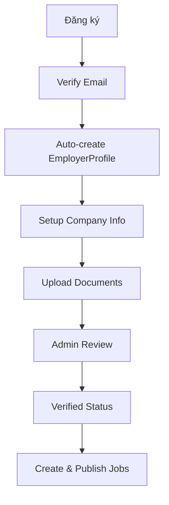
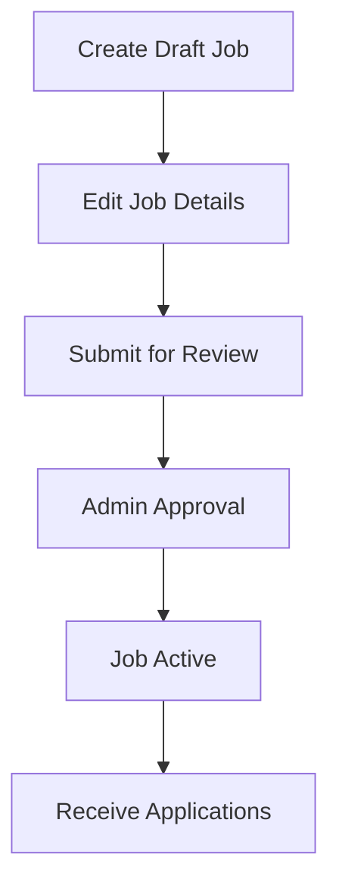

# 🚀 WORKFLOW IMPROVEMENTS SUMMARY

## 📋 Tổng quan cải tiến

Hệ thống đã được cải tiến toàn diện từ đăng ký đến quản lý job với workflow mượt mà và bảo mật cao.

## 🔧 Các cải tiến chính

### 1. 🔐 **Auto-creation EmployerProfile trong Email Verification**

**File**: `src/controllers/authController.js`

**Vấn đề cũ**: Employer phải tự tạo profile sau khi verify email
**Giải pháp**: Tự động tạo EmployerProfile với cấu trúc đầy đủ khi verify email

```javascript
// Auto-create EmployerProfile for employers
if (user.role === 'employer') {
  const employerProfile = new EmployerProfile({
    user: user._id,
    companyInfo: {
      name: 'Tên công ty chưa cập nhật',
      // ... default structure
    },
    verification: {
      status: 'pending',
      documents: [],
      // ... verification setup
    },
  });
  await employerProfile.save();
}
```

### 2. 🛡️ **Employer Verification Middleware**

**File**: `src/middleware/employerVerification.js`

**Chức năng**:

- `requireEmployerProfile`: Đảm bảo employer có profile
- `requireVerifiedEmployer`: Yêu cầu employer đã xác thực documents

```javascript
const requireVerifiedEmployer = async (req, res, next) => {
  const profile = await EmployerProfile.findOne({ user: req.user.id });

  if (profile.verification.status !== 'approved') {
    return res.status(403).json({
      success: false,
      message: 'Tài khoản chưa được xác thực',
    });
  }

  next();
};
```

### 3. 🔄 **Enhanced Job Controller với naming consistency**

**File**: `src/controllers/jobController.js`

**Cải tiến**:

- Đổi tên `getMyJobs` → `getEmployerJobs` (consistency)
- Thêm middleware verification cho các endpoint quan trọng
- Tối ưu query performance

### 4. 🛣️ **Updated Routes với Middleware Layers**

**Files**:

- `src/routes/jobs.js`
- `src/routes/employerProfiles.js`

**Security Layers**:

```javascript
// Basic operations - require profile only
router.get(
  '/profile',
  protect,
  authorize('employer'),
  requireEmployerProfile,
  getProfile
);

// Sensitive operations - require verification
router.get(
  '/applications',
  protect,
  authorize('employer'),
  requireVerifiedEmployer,
  getApplications
);
```

### 5. 📚 **Comprehensive API Documentation**

**File**: `API_STRUCTURE.md`

**Nội dung**:

- 80+ endpoints với middleware requirements
- Workflow logic chi tiết
- Filter parameters đầy đủ
- Response examples

## 🔄 Workflow hoàn chỉnh

### 👨‍💼 **Employer Journey**



### 📝 **Job Management Workflow**



## 🎯 **Middleware Security Matrix**

| Endpoint          | Auth | Role     | Profile | Verified |
| ----------------- | ---- | -------- | ------- | -------- |
| GET /profile      | ✅   | employer | ✅      | ❌       |
| POST /jobs        | ✅   | employer | ✅      | ❌       |
| POST /submit      | ✅   | employer | ✅      | ✅       |
| GET /applications | ✅   | employer | ✅      | ✅       |
| GET /analytics    | ✅   | employer | ✅      | ✅       |

## 📊 **Tác động cải tiến**

### ✅ **Trước khi cải tiến**

- Employer phải tự tạo profile manually
- Không có validation middleware
- Workflow bị đứt gãy
- Naming inconsistent

### 🚀 **Sau khi cải tiến**

- Auto-create profile seamless
- Multi-layer security validation
- Complete end-to-end workflow
- Consistent naming convention

## 🔧 **Technical Implementation**

### **Modified Files**:

1. `authController.js` - Auto-profile creation
2. `employerVerification.js` - New middleware
3. `jobs.js` routes - Security layers
4. `employerProfiles.js` routes - Verification requirements
5. `API_STRUCTURE.md` - Complete documentation

### **Key Features**:

- **Zero manual steps** for profile creation
- **Granular security** với middleware layers
- **Complete documentation** cho frontend integration
- **Backward compatible** với existing code

## 🎉 **Kết quả**

Hệ thống hiện tại đã có:

- ✅ **Seamless onboarding**: Từ đăng ký đến job posting không bị gián đoạn
- ✅ **Security by design**: Middleware validation ở mọi endpoint quan trọng
- ✅ **Complete documentation**: Frontend team có đầy đủ thông tin để integrate
- ✅ **Scalable architecture**: Dễ dàng thêm features mới

Employer journey bây giờ hoàn toàn mượt mà từ registration đến job publishing! 🎯
