# MongoDB Database Schema Diagram

## Database: `internship-recruitment-platform`

---

## Collections và Relationships

```mermaid
erDiagram
    %% Core User Collections
    users ||--o{ oauth_credentials : "has"
    users ||--o{ job_followings : "follows"
    users ||--o{ notifications : "receives"
    users ||--o| candidates : "is"
    users ||--o| employers : "is"

    %% Candidate Collections
    candidates ||--o{ educations : "has"
    candidates ||--o{ cvs : "has"
    candidates ||--o{ job_savings : "saves"
    candidates ||--o{ job_applications : "applies"
    candidates ||--o{ skill_graph_analyses : "has"
    candidates ||--o{ skill_maps : "has"
    candidates }o--o{ skills : "possesses"
    candidates ||--|| addresses : "lives_at"

    %% Employer Collections
    employers }o--o{ companies : "works_for"

    %% Company Collections
    companies ||--|| addresses : "located_at"
    companies }o--o{ industries : "belongs_to"
    companies ||--o{ job_postings : "posts"

    %% Job Collections
    job_postings ||--|| job_requirements : "requires"
    job_postings ||--|| salary_ranges : "offers"
    job_postings }o--o{ skills : "requires"
    job_postings }o--o{ industries : "in"
    job_postings ||--o{ job_applications : "receives"
    job_postings ||--o{ job_savings : "saved_by"

    %% Application Collections
    job_applications ||--|| match_results : "has"
    job_applications ||--|| cvs : "uses"

    %% Skill Management Collections
    skill_graph_analyses ||--o{ skill_gaps : "contains"
    skill_maps ||--o{ development_steps : "contains"
    development_steps ||--o{ resources : "includes"

    %% Reference Collections
    skills ||--o{ candidates : "possessed_by"
    skills ||--o{ job_postings : "required_by"
    industries ||--o{ companies : "categorized_by"
    industries ||--o{ job_postings : "categorized_by"

    %% User Collection
    users {
        ObjectId _id PK
        string email UK
        string passwordHash
        string fullName
        string phone
        enum userStatus "ACTIVE, INACTIVE"
        enum userRole "CANDIDATE, EMPLOYER"
        datetime lastLogin
        datetime createdAt
        datetime updatedAt
    }

    %% OAuth Credentials (Embedded in User)
    oauth_credentials {
        ObjectId _id PK
        ObjectId userId FK
        enum provider "GOOGLE"
        string providerId
        string accessToken
        string refreshToken
        datetime expiresIn
    }

    %% Candidate Collection
    candidates {
        ObjectId _id PK
        ObjectId userId FK "references users._id"
        string bio
        enum jobSeekingStatus "ACTIVE, INACTIVE"
        int profileCompleteness
        object address "embedded"
        array skills "ObjectId[] references skills._id"
        datetime createdAt
        datetime updatedAt
    }

    %% Employer Collection
    employers {
        ObjectId _id PK
        ObjectId userId FK "references users._id"
        ObjectId companyId FK "references companies._id"
        enum memberStatus "OWNER, MEMBER"
        datetime joinedAt
        datetime createdAt
        datetime updatedAt
    }

    %% Company Collection
    companies {
        ObjectId _id PK
        string name
        string description
        enum companySize "SMALL_1_10, MEDIUM_11_200, LARGE_201_1000, ENTERPRISE_1000_PLUS"
        string taxCode UK
        enum verificationStatus "PENDING, UNDER_REVIEW, VERIFIED"
        string website
        string businessEmail
        string businessPhone
        string businessLogoUrl
        date registrationDate
        object address "embedded"
        datetime createdAt
        datetime updatedAt
    }

    %% Address (Embedded Value Object)
    addresses {
        string street
        string city
        string state
        string country
        string zipCode
    }

    %% Education (Embedded in Candidate)
    educations {
        ObjectId _id PK
        ObjectId candidateId FK "references candidates._id"
        string degree
        string major
        string school
        date startDate
        date endDate
        float gpa
        datetime createdAt
        datetime updatedAt
    }

    %% CV Collection
    cvs {
        ObjectId _id PK
        ObjectId candidateId FK "references candidates._id"
        string content
        string fileName
        string fileUrl
        datetime uploadDate
        boolean isDefault
        datetime createdAt
        datetime updatedAt
    }

    %% Skill Collection
    skills {
        ObjectId _id PK
        string code UK
        string name
        string description
        array aliases "string[]"
        enum category "TECHNICAL, SOFT, LANGUAGE, TOOL, CERTIFICATION"
        int popularity
        enum demandLevel "CRITICAL, HIGH, MEDIUM, LOW"
        enum trend "EMERGING, STABLE, DECLINING"
        boolean isActive
        datetime createdAt
        datetime updatedAt
    }

    %% Industry Collection
    industries {
        ObjectId _id PK
        string code UK
        string name
        string description
        string parentCode "for hierarchy"
        boolean isActive
        datetime createdAt
        datetime updatedAt
    }

    %% Job Posting Collection
    job_postings {
        ObjectId _id PK
        ObjectId companyId FK "references companies._id"
        ObjectId postedBy FK "references employers._id"
        string title
        string description
        string requirements
        string benefits
        enum jobType "FULL_TIME, PART_TIME, CONTRACT, INTERNSHIP"
        enum jobStatus "DRAFT, PUBLISHED, CLOSED, EXPIRED, ARCHIVED"
        enum level "INTERN, JUNIOR, MIDDLE, SENIOR, MANAGER"
        enum workingMode "ONSITE, REMOTE, HYBRID"
        object address "embedded"
        object salaryRange "embedded"
        array skillIds "ObjectId[] references skills._id"
        array industryCodes "string[] references industries.code"
        datetime postedAt
        datetime expiresAt
        datetime deadline
        int positions
        int applicationCount
        int views
        datetime createdAt
        datetime updatedAt
    }

    %% Job Requirements (Embedded in Job Posting)
    job_requirements {
        array requiredSkills "string[]"
        array certifications "string[]"
        array languages "string[]"
        int minExperience
        int maxExperience
        string requiresCertification
    }

    %% Salary Range (Embedded in Job Posting)
    salary_ranges {
        double min
        double max
        string currency
    }

    %% Job Application Collection
    job_applications {
        ObjectId _id PK
        ObjectId candidateId FK "references candidates._id"
        ObjectId jobId FK "references job_postings._id"
        ObjectId cvId FK "references cvs._id"
        string coverLetter
        enum status "SUBMITTED, REVIEWED, ACCEPTED, REJECTED, WITHDRAWN"
        object matchResult "embedded"
        datetime submittedAt
        datetime reviewedAt
        datetime createdAt
        datetime updatedAt
    }

    %% Match Result (Embedded in Job Application)
    match_results {
        double score
        enum matchLevel "EXCELLENT, GOOD, FAIR, POOR"
        object scoreBreakdown "embedded"
        array strengths "string[]"
        array weaknesses "string[]"
        datetime calculatedAt
    }

    %% Job Saving Collection
    job_savings {
        ObjectId _id PK
        ObjectId candidateId FK "references candidates._id"
        ObjectId jobId FK "references job_postings._id"
        datetime savedAt
        datetime createdAt
    }

    %% Job Following Collection
    job_followings {
        ObjectId _id PK
        ObjectId userId FK "references users._id"
        enum targetType "JOB_POSTING, COMPANY"
        ObjectId targetId "references job_postings._id or companies._id"
        datetime followedAt
        datetime createdAt
    }

    %% Notification Collection
    notifications {
        ObjectId _id PK
        ObjectId userId FK "references users._id"
        enum type "JOB_APPLICATION_STATUS, NEW_JOB_WATCH, COMPANY_UPDATE, SKILL_RECOMMENDATION, SYSTEM_ANNOUNCEMENT, PROFILE_VIEW"
        string title
        string message
        object data "Map"
        boolean isRead
        datetime readAt
        datetime createdAt
    }

    %% Skill Graph Analysis Collection
    skill_graph_analyses {
        ObjectId _id PK
        ObjectId candidateId FK "references candidates._id"
        ObjectId jobId FK "references job_postings._id"
        array missingSkills "embedded skill_gaps[]"
        array recommendedCourses "string[]"
        enum analysisLevel "HIGH, MEDIUM"
        datetime generatedAt
        datetime nextUpdate
        datetime createdAt
        datetime updatedAt
    }

    %% Skill Gap (Embedded in Skill Graph Analysis)
    skill_gaps {
        ObjectId skillId FK "references skills._id"
        enum requiredLevel "BEGINNER, INTERMEDIATE, ADVANCED"
        enum currentLevel "BEGINNER, INTERMEDIATE, ADVANCED"
        string gapDescription
        int timeToClose "months"
        boolean isCritical
    }

    %% Skill Map Collection
    skill_maps {
        ObjectId _id PK
        ObjectId candidateId FK "references candidates._id"
        string targetSkillTitle
        enum currentSkillLevel "BEGINNER, INTERMEDIATE, ADVANCED"
        int estimatedMonths
        enum status "ACTIVE, COMPLETED, PAUSED, CANCELED"
        date completionDate
        array steps "embedded development_steps[]"
        datetime createdAt
        datetime updatedAt
    }

    %% Development Step (Embedded in Skill Map)
    development_steps {
        int stepOrder
        string title
        string description
        array resources "embedded resources[]"
        int estimatedHours
        enum status "PENDING, IN_PROGRESS, COMPLETED, SKIPPED"
        datetime completionDate
        datetime createdAt
    }

    %% Resource (Embedded in Development Step)
    resources {
        string title
        string description
        enum type "COURSE, ARTICLE, VIDEO, BOOK, PRACTICE_PROJECT, TUTORIAL"
        string provider
        string url
        int estimatedDuration "hours"
        enum difficultyLevel "BEGINNER, INTERMEDIATE, ADVANCED"
    }
```



---

## Indexes Strategy

### Users Collection
```javascript
db.users.createIndex({ email: 1 }, { unique: true })
db.users.createIndex({ userRole: 1 })
db.users.createIndex({ userStatus: 1 })
```

### Candidates Collection
```javascript
db.candidates.createIndex({ userId: 1 }, { unique: true })
db.candidates.createIndex({ jobSeekingStatus: 1 })
db.candidates.createIndex({ "skills": 1 })
```

### Employers Collection
```javascript
db.employers.createIndex({ userId: 1 }, { unique: true })
db.employers.createIndex({ companyId: 1 })
```

### Companies Collection
```javascript
db.companies.createIndex({ taxCode: 1 }, { unique: true })
db.companies.createIndex({ verificationStatus: 1 })
db.companies.createIndex({ name: "text" })
```

### Job Postings Collection
```javascript
db.job_postings.createIndex({ companyId: 1 })
db.job_postings.createIndex({ postedBy: 1 })
db.job_postings.createIndex({ jobStatus: 1 })
db.job_postings.createIndex({ expiresAt: 1 })
db.job_postings.createIndex({ "skillIds": 1 })
db.job_postings.createIndex({ title: "text", description: "text" })
db.job_postings.createIndex({ postedAt: -1 })
```

### Job Applications Collection
```javascript
db.job_applications.createIndex({ candidateId: 1, jobId: 1 }, { unique: true })
db.job_applications.createIndex({ jobId: 1 })
db.job_applications.createIndex({ status: 1 })
db.job_applications.createIndex({ submittedAt: -1 })
```

### Skills Collection
```javascript
db.skills.createIndex({ code: 1 }, { unique: true })
db.skills.createIndex({ name: "text" })
db.skills.createIndex({ isActive: 1 })
db.skills.createIndex({ category: 1 })
```

### Notifications Collection
```javascript
db.notifications.createIndex({ userId: 1, createdAt: -1 })
db.notifications.createIndex({ userId: 1, isRead: 1 })
```

### Job Followings Collection
```javascript
db.job_followings.createIndex({ userId: 1, targetType: 1, targetId: 1 }, { unique: true })
db.job_followings.createIndex({ userId: 1 })
```

---

## Relationships Summary

### One-to-Many Relationships (Using References)
- `users` → `oauth_credentials` (1:N)
- `users` → `notifications` (1:N)
- `users` → `job_followings` (1:N)
- `candidates` → `educations` (1:N)
- `candidates` → `cvs` (1:N)
- `candidates` → `job_applications` (1:N)
- `candidates` → `job_savings` (1:N)
- `candidates` → `skill_graph_analyses` (1:N)
- `candidates` → `skill_maps` (1:N)
- `companies` → `job_postings` (1:N)
- `job_postings` → `job_applications` (1:N)
- `job_postings` → `job_savings` (1:N)

### Many-to-Many Relationships (Using Arrays of ObjectIds)
- `candidates` ↔ `skills` (N:M) - stored as array in candidates
- `job_postings` ↔ `skills` (N:M) - stored as array in job_postings
- `companies` ↔ `industries` (N:M) - stored as array in companies
- `job_postings` ↔ `industries` (N:M) - stored as array in job_postings

### One-to-One Relationships (Using References)
- `users` → `candidates` (1:1) - via userId
- `users` → `employers` (1:1) - via userId
- `candidates` → `addresses` (1:1) - embedded
- `companies` → `addresses` (1:1) - embedded
- `job_applications` → `match_results` (1:1) - embedded
- `job_postings` → `job_requirements` (1:1) - embedded
- `job_postings` → `salary_ranges` (1:1) - embedded

### Embedded Documents
- `addresses` - embedded in `candidates` and `companies`
- `job_requirements` - embedded in `job_postings`
- `salary_ranges` - embedded in `job_postings`
- `match_results` - embedded in `job_applications`
- `skill_gaps` - embedded in `skill_graph_analyses`
- `development_steps` - embedded in `skill_maps`
- `resources` - embedded in `development_steps`

---

## Notes

1. **Embedding vs Referencing:**
   - **Embedded**: Address, Job Requirements, Salary Range, Match Result, Skill Gaps, Development Steps, Resources
   - **Referenced**: User relationships, CVs, Applications, Skills, Industries

2. **Array References:**
   - Skills in Candidates and Job Postings are stored as arrays of ObjectIds
   - Industry codes in Companies and Job Postings are stored as arrays of strings

3. **Denormalization Opportunities:**
   - Consider embedding frequently accessed data (e.g., company name in job postings)
   - Store computed values (e.g., applicationCount, views) for performance

4. **Data Consistency:**
   - Use transactions for critical operations (e.g., creating job application)
   - Implement application-level validation for references